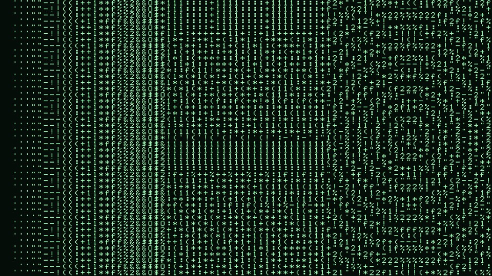
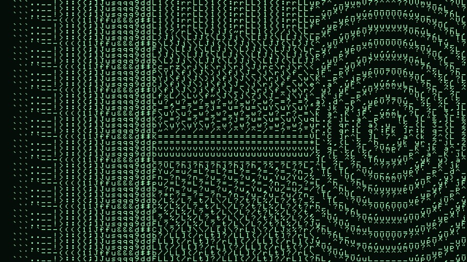
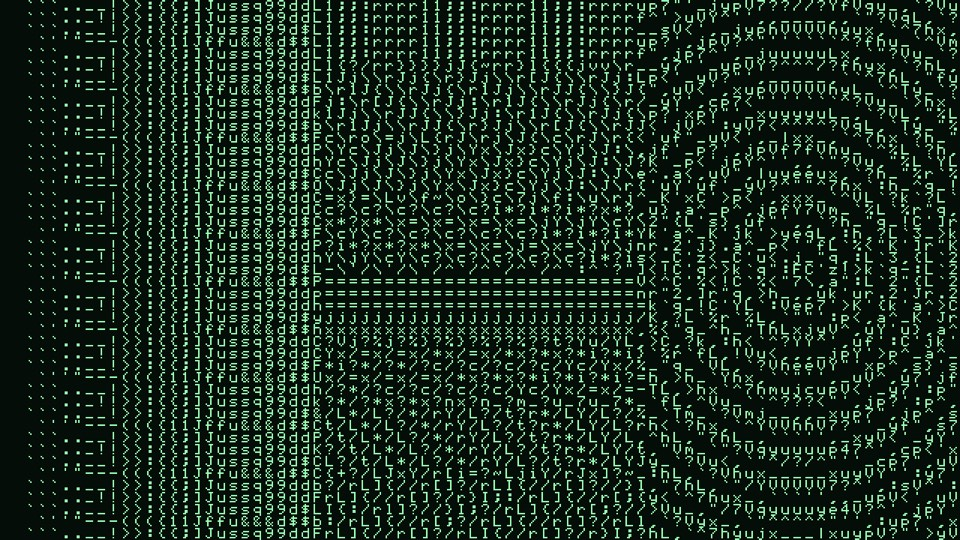
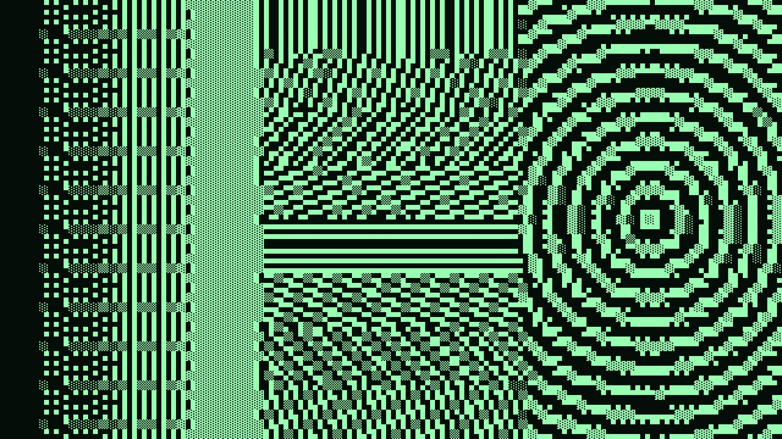
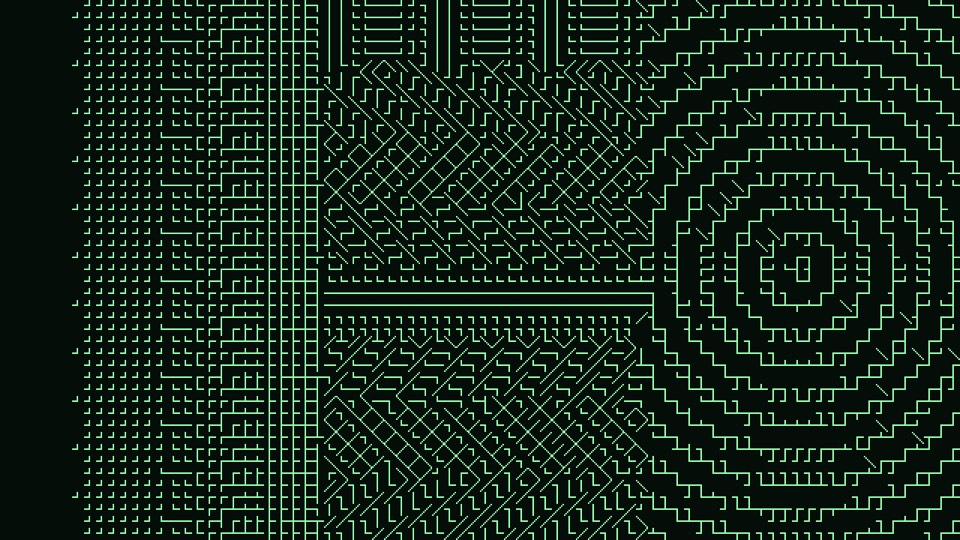
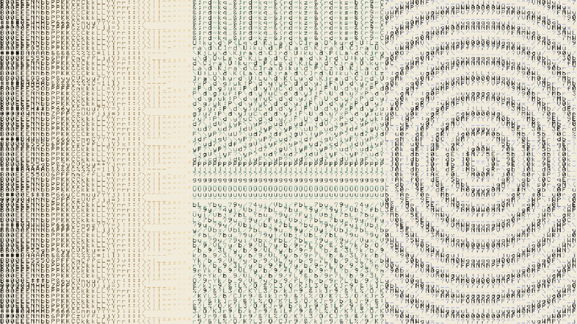
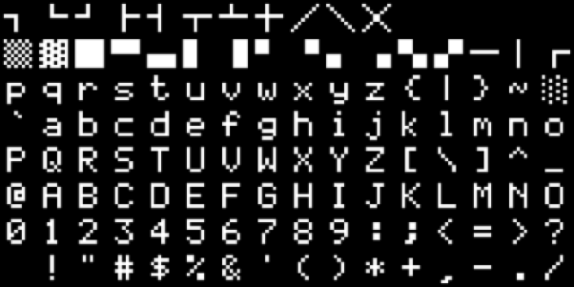

# Asciify

> **AI-assisted project.** This codebase was created with [Claude](https://claude.com/claude-code)
> (Anthropic), directed and reviewed by a human author. The character matching is
> verified numerically by an offline harness that drives the real plugin class in
> a headless GL context: it renders at one output pixel per glyph pixel, reads the
> chosen characters back out of the frame, and compares them against an
> independent C++ implementation — 43 runs of 960 cells across every character
> set, with zero disagreements (see [Status](#status)). It has **never been
> loaded into Resolume** — only compiled, rendered and measured offline. Check it
> in your own rig before trusting it in a show.

An ASCII art renderer for [Resolume](https://resolume.com) Arena and Avenue, as
an FFGL effect. It divides the frame into character cells and replaces each one
with the character that stands in for it best.

**Video:** [What it does, in 45 seconds](https://www.youtube.com/watch?v=Hzy60YIhKpg)


<sub>The repo's type card at 80 columns — a tone ramp on the left, bars at eight
angles in the middle, concentric rings on the right. Rendered by `asctest`, the
offline harness.</sub>

## It matches shape, not just brightness

Most ASCII art is a brightness ramp: measure a cell, look the value up in a
hand-written string like `" .:-=+*#%@"`, print that character. It works, and it
throws away every edge in the picture.

Asciify treats a cell as **a small picture**, and picks the character whose ink
is distributed most like it. Two things are measured — on the same 8×8 grid, for
the cell and for every glyph — and matched:

- **how much ink**, which is coverage
- **where the ink is**, as five moments of the ink distribution

That second half is enough to tell `|` from `-`, `/` from `\`, and `.` from `'`,
so edges start picking up characters that lean the right way. Nothing detects an
edge; a cell containing a diagonal simply has a shape vector pointing the same
direction a slash does.

| | |
| --- | --- |
|  |  |
| **Structure 0** — coverage alone. This is the classic ramp, and there is no separate code path for it: weight the shape term to nothing and what is left is a nearest-neighbour lookup by weight. | **Structure 1** — the match may stray up to a third of the alphabet's tonal range to get the direction right. Watch the rings and the angled bars. |

The control is the *allowance*: how far the match may depart from the correct
weight in order to get the shape right. Flat cells ignore it entirely — a cell
with no direction has nothing to be wrong about, so the term fades out on its
own rather than being gated by a threshold.

## The ramp is measured, not written down

Nothing in this plugin carries a dark-to-light ordering. The font is drawn in
`source/FontData.cpp`, every glyph's ink is measured off its bitmap, and the
ordering is a *consequence*. Redraw a character and it moves in the ramp; pick a
different alphabet and the tone range is re-measured to whatever that set can
actually express.

That is not a theoretical distinction. On this font the measured order of the
traditional ramp is `.-:+=*%#@` — `-` outweighs `:` and `%` is lighter than `#`,
both against the string everybody copies. `asctest --ramp` prints it:

```
Classic ramp: 10 characters, coverage 0.0000 .. 0.3125
  measured ink, lightest first:
   .-:+=*%#@
```

## Nine alphabets

| | |
| --- | --- |
|  |  |
| **ASCII** — all 95 printable characters. The default. | **Blocks** — the only set with a full tonal range, because block elements are the only characters that can reach solid. |
|  |  |
| **Box drawing** — almost no tonal range, so it is chosen *entirely* on structure. Turn Structure down here and the picture collapses. | **Inverted, tinted, on paper** — ink taking the clip's own colour, dark-on-light. |

Plus Letters, Digits, Symbols, the Classic ramp, Binary, and **Custom** — type
your own string, in UTF-8, and the plugin measures it like any other set.

The font is drawn by hand for this project, 123 glyphs on a 5×7 body in an 8×8
cell, so it is MIT along with everything else and there is nothing vendored:



## Try it in your browser

**<https://asciify-demo.stoatworks-labs.com>**

Not the plugin — the GLSL from `source/Shaders.cpp`, copied across unedited and run in
WebGL2 over clips generated in the page, with the parameters this plugin's
constructor declares and the conversions its own code applies. No install, and
nothing you load leaves your machine.

The font is extracted from `source/FontData.cpp` rather than redrawn, so the ramp on the page is this font's own measured order. Drag Structure to zero and it collapses into exactly that ramp, with no separate code path.

It is a port, so it is not evidence about the plugin: a browser is not Resolume,
GLSL ES 3.00 is not desktop GL 4.1 core, and nothing on that page measures
anything. The page says all of that itself, in a disclosure at the foot. The
numbers worth trusting are in [Status](#status) and come from the offline
harness in this repository.

<!-- downloads:start -->

## Download

**[v0.1.0](https://github.com/stoatworks-labs/asciify/releases/tag/v0.1.0)** — prebuilt for macOS and Windows. Pick your platform:

<details>
<summary><b>macOS</b> — Universal (Apple Silicon + Intel)</summary>

| Build | Download | Size |
| --- | --- | --- |
| Universal (Apple Silicon + Intel) · .dmg disk image | [`asciify-0.1.0-macos-universal.dmg`](https://github.com/stoatworks-labs/asciify/releases/download/v0.1.0/asciify-0.1.0-macos-universal.dmg) | 209 KB |
| Universal (Apple Silicon + Intel) · .zip archive | [`asciify-macos-universal.zip`](https://github.com/stoatworks-labs/asciify/releases/latest/download/asciify-macos-universal.zip) | 165 KB |

</details>

<details>
<summary><b>Windows</b> — x64</summary>

| Build | Download | Size |
| --- | --- | --- |
| x64 · .exe installer | [`asciify-0.1.0-windows-x86_64-setup.exe`](https://github.com/stoatworks-labs/asciify/releases/download/v0.1.0/asciify-0.1.0-windows-x86_64-setup.exe) | 219 KB |
| x64 · .zip archive | [`asciify-windows-x86_64.zip`](https://github.com/stoatworks-labs/asciify/releases/latest/download/asciify-windows-x86_64.zip) | 113 KB |

</details>

All builds, checksums and release notes: [github.com/stoatworks-labs/asciify/releases](https://github.com/stoatworks-labs/asciify/releases).

<!-- downloads:end -->

The macOS build is **not notarised**. See [UNSIGNED.md](docs/UNSIGNED.md).

There is a **[user guide](docs/USER-GUIDE.md)** if you would rather be told which
two controls matter than read the whole list.

## Controls

**Type**

| Control | What it does |
| --- | --- |
| **Columns** | 8 to 320 characters across, logarithmically. Rows follow from the output aspect so cells stay square and the characters are not stretched. |
| **Characters** | Which alphabet is in play. ASCII, Letters, Digits, Symbols, Classic ramp, Binary, Blocks, Box drawing, Custom. |
| **Custom Set** | The string used when Characters is set to Custom. UTF-8; block and box characters work. Anything the font cannot draw is skipped, and an empty result falls back to ASCII rather than rendering a blank frame. |
| **Structure** | How far the match may stray from the correct weight to get the shape right, as a fraction of the alphabet's range. 0 is the classic tone ramp. |
| **Tone** | Gamma, 4 down to ¼, with 1 in the centre of the slider. |
| **Contrast** | ¼ to 4 about mid grey, with 1 in the centre. |
| **Invert** | Dark parts of the clip get the heavy characters — printing on paper rather than glowing on a tube. |
| **Dither** | Ordered dither of exactly one quantisation step, which breaks up the banding a small alphabet leaves in a gradient. |

**Colour**

| Control | What it does |
| --- | --- |
| **Tint** | Fades the ink from the Ink colour to the clip's own colour in that cell. |
| **Ink** | The characters. |
| **Paper** | What shows behind them. |
| **Paper Opacity** | 0 leaves the background transparent, so only the characters composite. |

**Output**

| Control | What it does |
| --- | --- |
| **Glyph Edge** | Crisp keeps the glyph's own pixels — what a character on a screen actually was. Smooth filters them, which is what you want when the cells are small enough to shimmer. |
| **Mix** | Wet/dry. The null for the whole effect. |

Transparent parts of the clip stay transparent: an ASCII render of nothing is
nothing, not a field of spaces on black.

## Install

Drop the bundle (macOS) or the `.dll` (Windows) into Resolume's extra effects
folder and restart Resolume:

- macOS — `~/Documents/Resolume Arena/Extra Effects/`
- Windows — `Documents\Resolume Arena\Extra Effects\`

Use `Resolume Avenue` in place of `Resolume Arena` for Avenue. The effect appears
as **Asciify**.

## Build

Needs CMake 3.15+, a C++17 compiler, and the FFGL SDK, which is a submodule.

```bash
git clone --recursive https://github.com/stoatworks-labs/asciify
cd asciify
cmake -B build -DCMAKE_BUILD_TYPE=Release
cmake --build build
cmake --install build          # straight into Resolume's plugin folder
```

macOS builds universal (arm64 + x86_64) by default; add
`-DCMAKE_OSX_ARCHITECTURES=arm64` for a faster development build. Windows needs
GLEW, which `vcpkg.json` declares.

`CLAUDE.md` is the short command reference. `AGENTS.md` is the one to read before
changing anything — it has the design invariants and the traps.

## Status

**Verified, by measurement, offline:**

- **The GPU picks the character the C++ predicts.** `asctest --match` renders at
  exactly one output pixel per glyph pixel, so every cell of the frame *is* an
  8×8 glyph bitmap that can be read back and named — then compared against an
  independent CPU implementation of the same matching. Across five Structure
  settings × eight character sets × three custom alphabets, 43 runs of 960
  cells: **zero disagreements**. That path goes through the mip chain, the tone
  curve, the dither, the moment measurement, the search, and the atlas
  addressing, so it is a stronger check than it looks.
- **No control is silently dead.** All 18 parameters measurably change the
  picture (`tools/sweep.py`), including the text parameter.
- **The font's invariants** — 123 glyphs inside a 128-slot atlas, no duplicate
  code points, no two glyphs drawn identically (`asctest --font`).
- **The macOS build is universal and exports `plugMain`** — `lipo` reports
  `x86_64 arm64`.
- **It compiles on Windows.** A `workflow_dispatch` run of the release workflow
  builds the macOS universal bundle, the Windows x64 `.dll` and the NSIS
  installer, all green. The release job is gated on a `v*` tag, so that run
  publishes nothing — it is the cheap way to check a build.

**Not verified:**

- **It has never been loaded into Resolume.** Everything about how the
  parameters *present* in the host is untested — the colour swatches, the
  grouping, and in particular whether the Custom Set text field appears at all.
- **Never built on Linux.** There is no CI job for it. Nothing in the code is
  platform-specific outside `Diag.cpp`, but that is an argument.
- **Nothing timed.** The cell pass compares every glyph in the alphabet against
  every cell. It should be cheap — it runs at one pixel per character, not per
  screen pixel — but that is an argument, not a measurement.

Run `tools/verify.sh` to reproduce all of the above in one go.

## Diagnostics

A shader that will not compile looks, from the operator's side, exactly like an
effect that does nothing — with no message anywhere. So the plugin keeps a log:

    macOS    ~/Library/Logs/asciify/asciify.YYYY-MM-DD.log
    Windows  %LOCALAPPDATA%\asciify\logs\asciify.YYYY-MM-DD.log

It records which of the three passes failed, and the GL vendor, renderer and
version next to it. No crash handler — a plugin has no business deciding what
happens when Resolume dies.

## Licence

MIT. See [LICENSE](LICENSE). The font in `source/FontData.cpp` was drawn for this
project and is covered by the same licence. The [FFGL SDK](https://github.com/resolume/ffgl)
is Resolume's, under its own terms.
